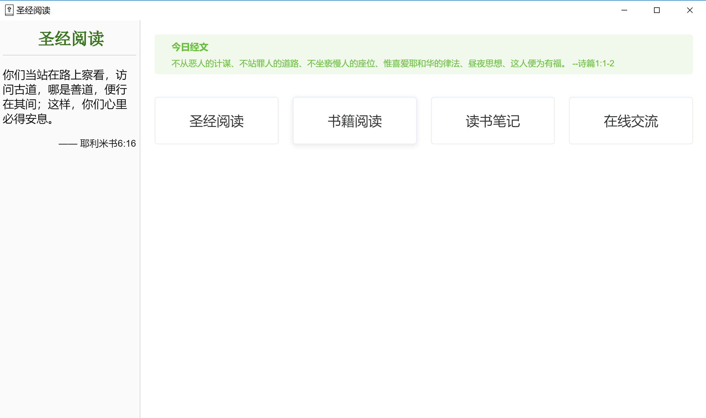
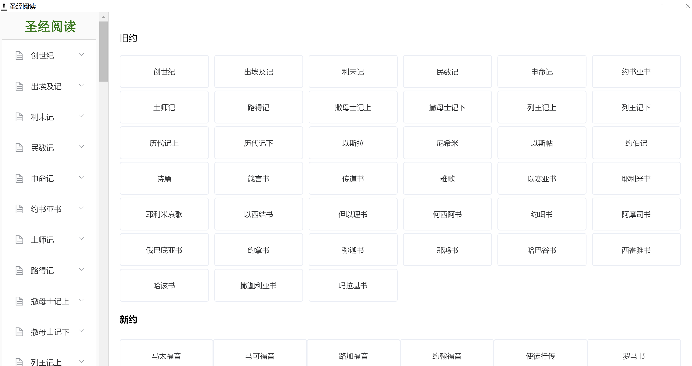
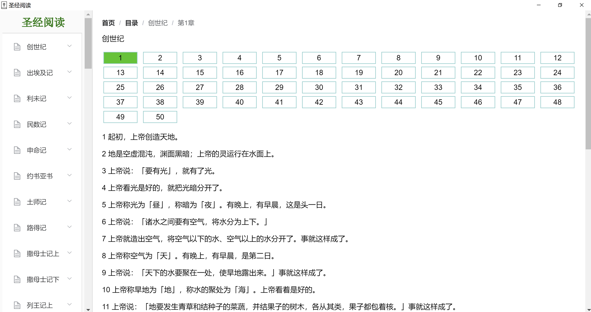

# bible

> 圣经阅读器






#### Build Setup

``` bash
# install dependencies
npm install

# serve with hot reload at localhost:9080
npm run dev

# build electron application for production
npm run build

# run unit & end-to-end tests
npm test


# lint all JS/Vue component files in `src/`
npm run lint

```

### 数据库问题
使用了`lowdb`作为数据库存储，遇到初始化数据的坑

采用了引入 `bible.json`文件解决


This project was generated with [electron-vue](https://github.com/SimulatedGREG/electron-vue)@[4c6ee7b](https://github.com/SimulatedGREG/electron-vue/tree/4c6ee7bf4f9b4aa647a22ec1c1ca29c2e59c3645) using [vue-cli](https://github.com/vuejs/vue-cli). Documentation about the original structure can be found [here](https://simulatedgreg.gitbooks.io/electron-vue/content/index.html).
